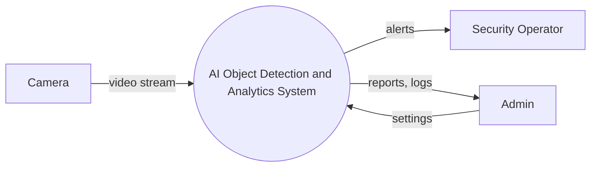
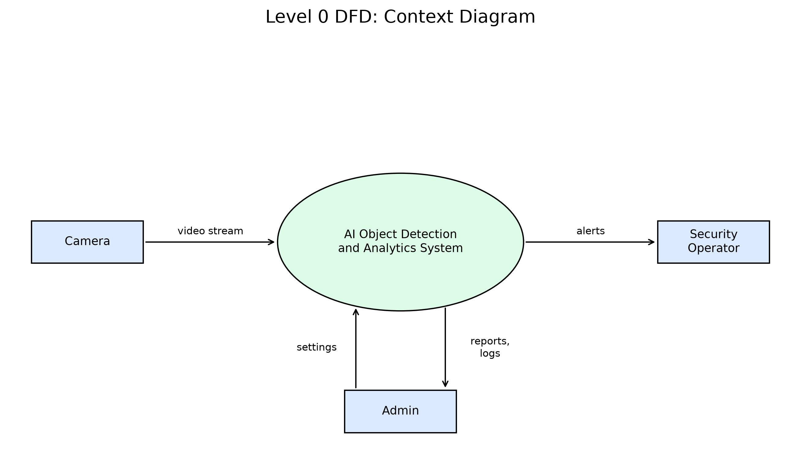
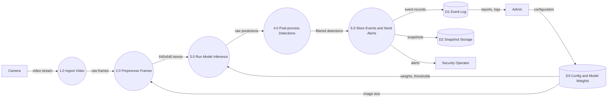
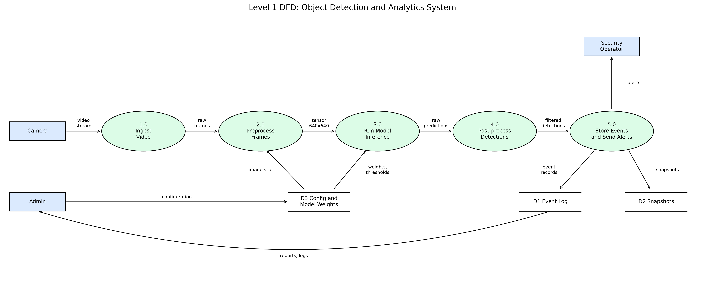

# System Design Specification: AI Object Detection and Analytics System

**Course:** AI Project Design and Development (AI-316)
**Author:** Abdul Rehman Ali

## 1. Requirements

### 1.1 Functional Requirements (Smart Automated Attendance System)

| ID | Functional Requirement | Measure |
|----|------------------------|---------|
| FR1 | Detect all faces in each camera frame | Under 200 ms per frame |
| FR2 | Match each detected face to an enrolled student | Returns student ID and confidence score |
| FR3 | Log attendance with student ID, course, date and time | One record per student per session |
| FR4 | Sync local records to the central database | Every 5 minutes, retry on failure |
| FR5 | Export attendance reports | CSV or PDF by class and date range |

### 1.2 Non-Functional Requirements

| ID | Non-Functional Requirement | Target |
|----|----------------------------|--------|
| NFR1 | Frame rate on the edge device | At least 15 FPS |
| NFR2 | Recognition accuracy | At least 95% accuracy, false accept rate under 1% |
| NFR3 | Edge device power usage | 15 W or less |
| NFR4 | Data privacy | Face embeddings encrypted (AES-256), raw video deleted within 24 hours |
| NFR5 | Availability | 99% uptime in class hours, works offline for 24 hours |

## 2. System Boundary and Input/Output Mapping

### 2.1 Actors

| Actor | Role |
|-------|------|
| Security Operator | Watches live alerts and confirms or dismisses them |
| Administrator | Sets thresholds, manages cameras and reviews reports |
| IP Camera | Supplies the video stream |
| Automated Trigger System | Raises alerts when a rule matches (person in restricted zone) |

### 2.2 Inputs

| Input | Specification |
|-------|---------------|
| Video stream | RTSP, H.264, 1920x1080, 25 FPS |
| Sensor parameters | Exposure, night mode, camera ID, zone ID |
| Configuration file | Confidence threshold, alert classes, ROI polygon |
| Model weights | YOLO `.pt` file |

### 2.3 Outputs

| Output | Specification |
|--------|---------------|
| Bounding boxes | `x1, y1, x2, y2`, class name, confidence |
| Alert notifications | Dashboard popup, email or SMS |
| Log entries | Timestamp, class, confidence, box coordinates |
| Snapshots | JPEG saved as `YYYYMMDD_HHMMSS.jpg` |

### 2.4 Operational Constraints

| Constraint | Limit |
|------------|-------|
| Memory footprint | 4 GB RAM, 2 GB GPU memory |
| Bandwidth | 4 Mbps per camera stream |
| End-to-end latency | 500 ms from frame to alert |
| Storage | 50 GB, snapshots kept 30 days |

## 3. Data-Flow Diagrams

### 3.1 Level 0 (Context Diagram)




### 3.2 Level 1




## 4. Modular Software Architecture

### 4.1 Module Overview

| Module | Responsibility | Input | Output |
|--------|----------------|-------|--------|
| DataIngestion | Opens a camera, video file or RTSP stream and reads frames | Source string | Frame (`np.ndarray`) |
| ImagePreprocessor | Letterbox resize to 640x640 and normalize to 0.0 to 1.0 | BGR frame | `float32` array |
| ModelInferenceEngine | Loads YOLO weights and runs detection | Frame | List of detection dictionaries |
| AlertLogger | Checks priority classes, saves snapshots, writes the event log, sends alerts | Frame and detections | Snapshot path, log entry |

### 4.2 Class Definitions

**src/data_ingestion.py**
```python
from typing import Optional, Tuple

import numpy as np


class DataIngestion:
    def __init__(self, source: str, width: int = 1280, height: int = 720) -> None:
        pass

    def open(self) -> bool:
        pass

    def is_opened(self) -> bool:
        pass

    def read_frame(self) -> Tuple[bool, Optional[np.ndarray]]:
        pass

    def release(self) -> None:
        pass
```

**src/image_preprocessor.py**
```python
from typing import Tuple

import numpy as np


class ImagePreprocessor:
    def __init__(self, target_size: Tuple[int, int] = (640, 640)) -> None:
        pass

    def letterbox(self, frame: np.ndarray) -> np.ndarray:
        pass

    def normalize(self, frame: np.ndarray) -> np.ndarray:
        pass

    def process(self, frame: np.ndarray) -> np.ndarray:
        pass
```

**src/model_inference_engine.py**
```python
from typing import Dict, List

import numpy as np


class ModelInferenceEngine:
    def __init__(self, model_path: str = 'yolov8n.pt', conf_threshold: float = 0.5) -> None:
        pass

    def load_model(self) -> None:
        pass

    def predict(self, frame: np.ndarray) -> List[Dict]:
        pass

    def get_class_names(self) -> Dict[int, str]:
        pass
```

**src/alert_logger.py**
```python
from typing import Dict, List

import numpy as np


class AlertLogger:
    def __init__(self, log_path: str = 'logs/events.log', alert_dir: str = 'alerts') -> None:
        pass

    def should_alert(self, detections: List[Dict], priority_classes: List[str], threshold: float) -> bool:
        pass

    def save_snapshot(self, frame: np.ndarray) -> str:
        pass

    def log_event(self, detection: Dict) -> None:
        pass

    def send_alert(self, message: str) -> None:
        pass
```

### 4.3 Detection Format

Each item returned by `ModelInferenceEngine.predict` is a dictionary:

```python
{'bbox': (x1, y1, x2, y2), 'confidence': 0.91, 'class_id': 0, 'class_name': 'person'}
```
